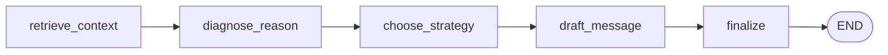

# PayPilot

**An AI dunning agent that recovers failed subscription payments.**

**[Live demo -> paypilot.fly.dev](https://paypilot.fly.dev/)** - try it in the browser, no setup or API key required.

When a recurring charge fails, most of that revenue is recoverable - the customer
didn't *decide* to churn, their card just expired or a payment bounced. PayPilot
turns each `invoice.payment_failed` event into a grounded, on-brand recovery
action: it diagnoses *why* the payment failed, picks the right retry strategy for
that reason, and drafts a warm, one-click dunning email - all in a single API call.

It's built as a small, readable [LangGraph](https://langchain-ai.github.io/langgraph/)
agent with retrieval-augmented generation (RAG) over a dunning playbook, exposed
through a [FastAPI](https://fastapi.tiangolo.com/) endpoint. The whole thing runs
its test suite with **no API key and no network**.

---

## How it works

A failed-payment event flows through a five-node LangGraph `StateGraph`. Each node
enriches a shared, typed `RecoveryState` and hands it to the next:



| Node | What it does |
|------|--------------|
| `retrieve_context` | Loads the customer record and pulls relevant snippets from the dunning playbook via the RAG retriever. |
| `diagnose_reason`  | LLM call: a 1-2 sentence, playbook-grounded diagnosis of *why* the payment failed. |
| `choose_strategy`  | **Deterministic** (no LLM): maps the failure code to a fixed action + retry cadence, so behaviour is stable and unit-testable. |
| `draft_message`    | LLM call: a short, warm dunning email with one clear call to action. |
| `finalize`         | Assembles the `{diagnosis, strategy, message}` response payload. |

### Why RAG?

The recovery quality depends on dunning best-practice - retry timing, tone, when to
offer a grace period. Rather than bake that into prompts, PayPilot keeps it in an
editable knowledge source ([`data/playbook.md`](data/playbook.md)) that the
retriever (Chroma + OpenAI embeddings, `k=3`) feeds into the diagnosis and drafting
nodes. Update the playbook, and the agent's behaviour updates with it - no code change.

### Why a deterministic strategy node?

`choose_strategy` is intentionally *not* an LLM call. Retry cadence and the chosen
action come from a fixed rules table keyed on the Stripe-style failure code:

| Failure code         | Retry in | Action                | Tone              |
|----------------------|----------|-----------------------|-------------------|
| `card_expired`       | ~1 day   | Request card update   | Friendly, routine |
| `insufficient_funds` | ~3 days  | Wait and retry        | Soft, no pressure |
| `generic_decline`    | ~2 days  | Retry / verify        | Calm, helpful     |

The LLM writes the *message*; the *policy* stays predictable.

---

## Quickstart

```bash
# 1. Install
python -m venv .venv && source .venv/bin/activate
pip install -r requirements.txt

# 2. Configure (only needed to call the live LLM; tests don't need it)
cp .env.example .env   # then add your OPENAI_API_KEY

# 3. Run the API
uvicorn app.api:app --reload
```

### Call it

```bash
curl -s http://localhost:8000/payment-failed \
  -H 'Content-Type: application/json' \
  -d '{
        "customer_id": "cust_001",
        "amount": 1499.0,
        "currency": "usd",
        "failure_code": "card_expired",
        "attempt": 1
      }' | jq
```

```jsonc
{
  "diagnosis": "Acme Robotics' card on file has expired, so the June charge failed; ...",
  "strategy": { "action": "request_card_update", "retry_in_days": 1, "offer": "..." },
  "message": "Hi Acme Robotics, we tried to renew your Scale plan but your card on file has expired ..."
}
```

`GET /health` returns `{"status": "ok"}` for liveness checks.

---

## Testing

The two external seams - the chat model (`app.nodes.get_llm`) and the retriever
(`app.nodes.get_retriever`) - are swapped for in-memory fakes in the tests, so the
suite runs offline with no API key:

```bash
pytest -q
```

CI ([`.github/workflows/ci.yml`](.github/workflows/ci.yml)) runs the same suite on
every push and pull request.

---

## Project layout

```
app/
  ingest.py   # build/cache the Chroma retriever over the playbook
  nodes.py    # the five node functions (+ get_llm seam, strategy rules table)
  graph.py    # RecoveryState + StateGraph wiring + run_recovery()
  api.py      # FastAPI: POST /payment-failed, GET /health
data/
  playbook.md     # dunning best-practice - the RAG knowledge source
  customers.json  # sample customer + payment-history fixtures
tests/
  test_graph.py   # end-to-end + strategy table + API, all mocked
```

## Run with Docker

```bash
docker build -t paypilot .
docker run -p 8000:8000 --env-file .env paypilot
```

---

## Design notes

- **One LLM seam.** Every chat call goes through `get_llm()`, so the model is
  configurable (`OPENAI_MODEL`, default `gpt-4o-mini`) and trivially mockable.
- **Graph compiled once.** `app.graph.graph` is built at import and reused; the
  nodes resolve `get_llm` / `get_retriever` by name at call time, which is what
  makes monkeypatching the compiled graph work in tests.
- **Fails safe.** Unknown customers and unexpected failure codes degrade to sane
  defaults instead of raising, so a malformed webhook never takes the endpoint down.

PayPilot is a focused portfolio project: a realistic, testable agentic system -
RAG + LangGraph + FastAPI - applied to a problem (involuntary churn / dunning) where
recovered revenue is directly measurable.
